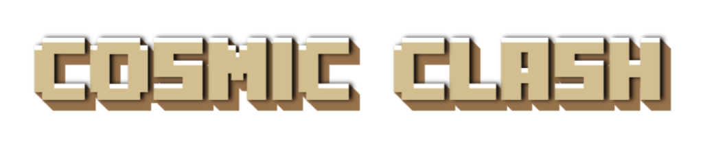
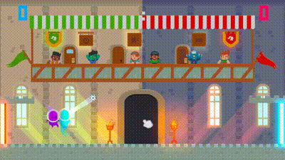
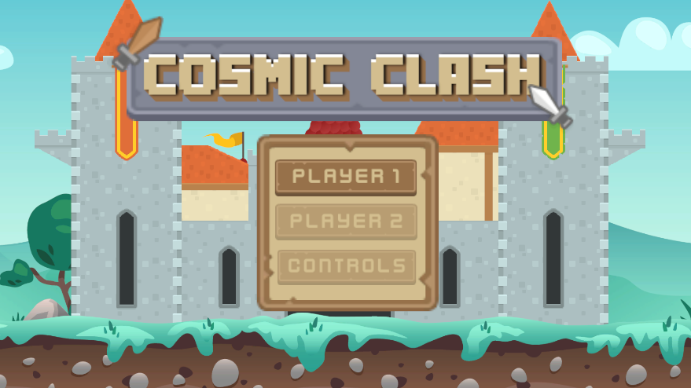

## Table of Contents
- [About the Game](#about-the-game)
- [Demo](#demo)
- [Installation](#installation)
- [How to Play](#how-to-play)
- [Features](#features)

## About the Game
A 2D Unity arcade game inspired by Rayman Legends' Kung Foot and Head Soccer, featuring cute alien characters. The game can be played against AI or in a 1v1 PVP local couch multiplayer mode. The goal is simple: two players aim to score by getting the ball into the opponent's goal. The first player to reach the defined score limit wins.


### Demo




### Game Modes

There are three game modes available: football, volley and basket.



#### Football


#### Volley


There is a 7 second limit for how long the ball can be in the same area.
If the limit is exceeded, the other player scores a point.

#### Basket


## Installation
Step-by-step instructions on how to get a development environment running.

1. Clone the repository:
    ```sh
    git clone https://github.com/ad0n1sdllpc/cosmic-clash-2d-unity.git
    ```
2. Open the project in Unity:
    - Open Unity Hub.
    - Click on "Add" and navigate to the cloned repository.
    - Select the folder and click "Open".

## How to Play
Explain the basic controls and objectives of the game.

- **Move**: Arrow keys or WASD
- **Jump**: Spacebar
- **Attack**: Ctrl or Z

## Features
List the main features of the game.

- Feature 1
- Feature 2
- Feature 3

