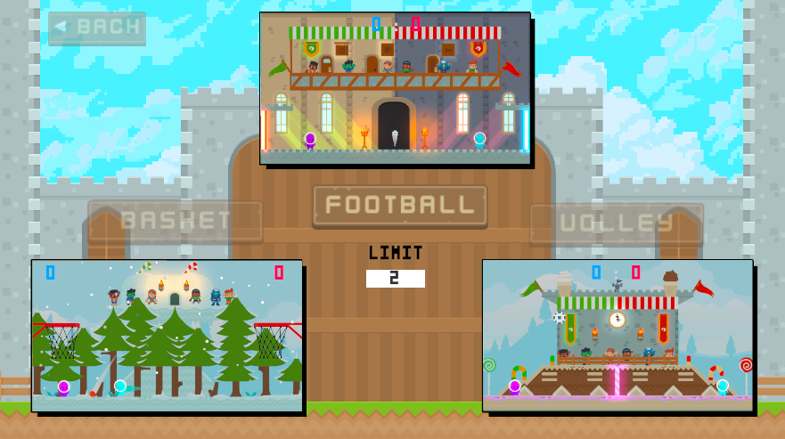
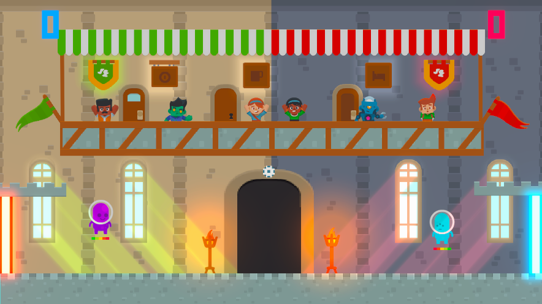
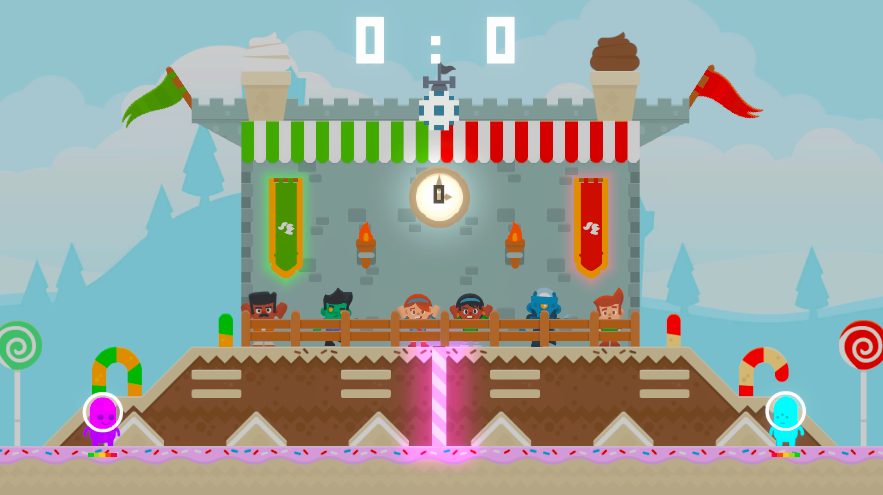
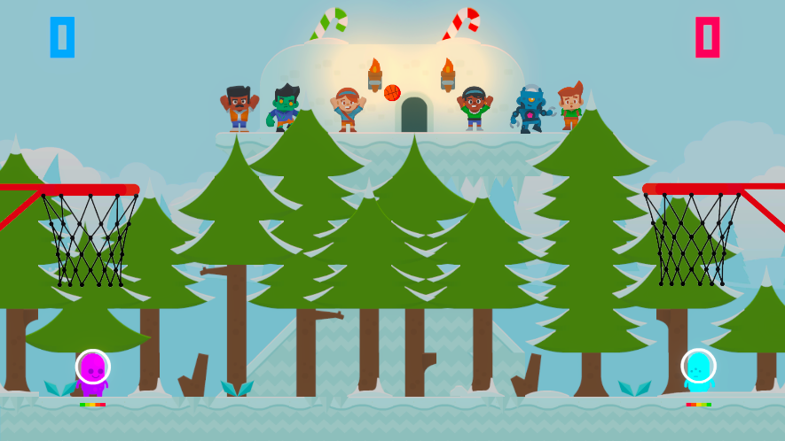
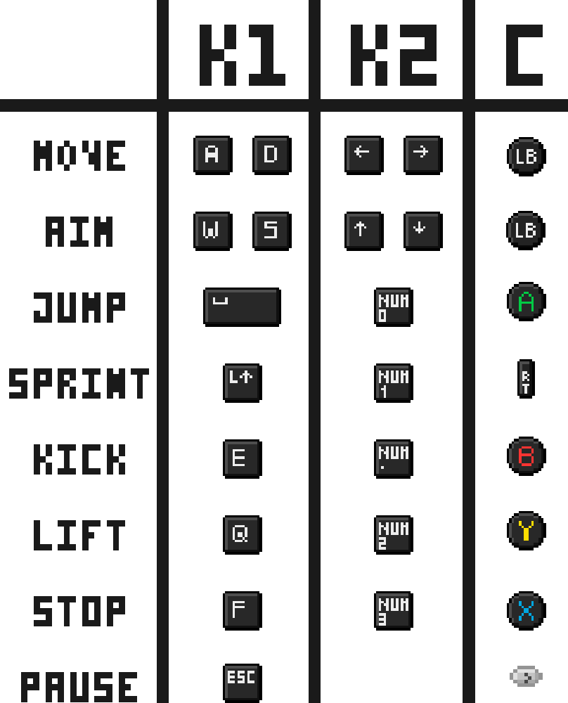
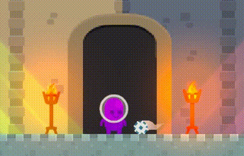
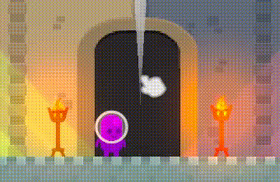
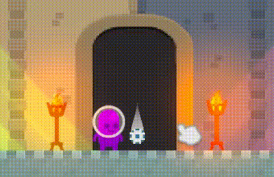

## Table of Contents
- [About the Game](#about-the-game)
- [Demo](#demo)
- [Installation](#installation)
- [How to Play](#how-to-play)
- [Abilities](#abilities)

## About the Game
A 2D Unity arcade game inspired by Rayman Legends' Kung Foot and Head Soccer, featuring cute alien characters. The game can be played against AI or in a 1v1 PVP local couch multiplayer mode. The goal is simple: two players aim to score by getting the ball into the opponent's goal. The first player to reach the defined score limit wins.


### Demo


### Game Modes

There are three game modes available: football, volley and basket.



#### Football



#### Volley



There is a 7 second limit for how long the ball can be in the same area.
If the limit is exceeded, the other player scores a point.

#### Basket



## Installation
Step-by-step instructions on how to get a development environment running.

1. Clone the repository:
    ```sh
    git clone https://github.com/ad0n1sdllpc/cosmic-clash-2d-unity.git
    ```
2. Open the project in Unity:
    - Open Unity Hub.
    - Click on "Add" and navigate to the cloned repository.
    - Select the folder and click "Open".

## How to Play

Both keyboard and controller are supported, with the controller being the preferred method of play. You can switch inputs in the 'Controls' menu.



You can navigate the menu using either the mouse or the keyboard/controller. To change the goal limit, select the input field and enter the desired number or use the vertical navigation keys (W, S, up, down, LB).

## Abilities

The game offers three different abilities:

- **Kick** - kick the ball, with a specific power and direction;


- **Lift** - lift the ball (90 degrees angle);


- **Stop** - stop the ball;

